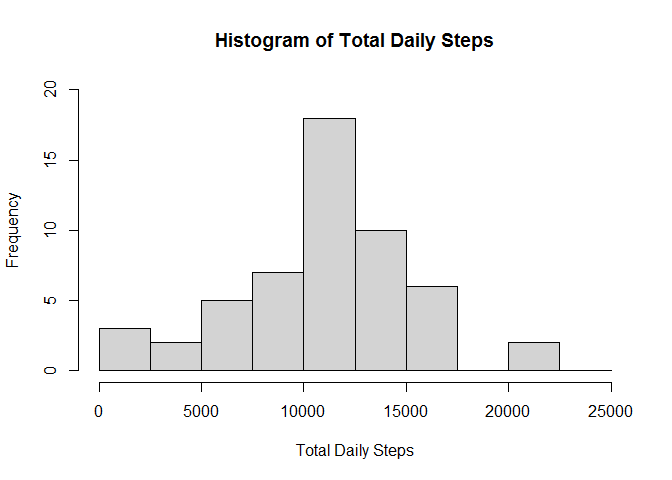
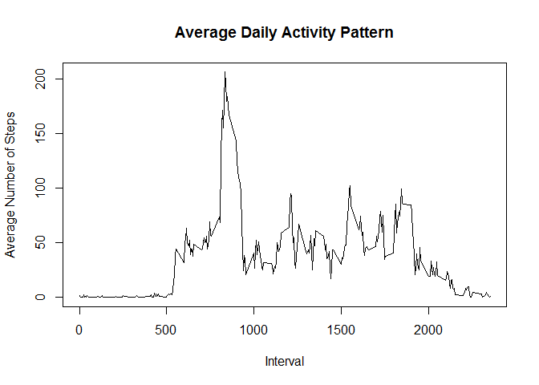
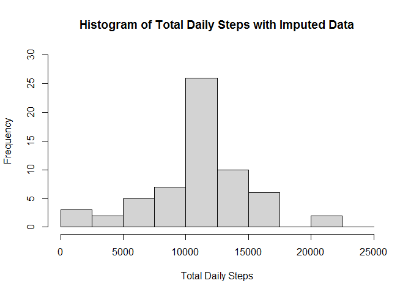
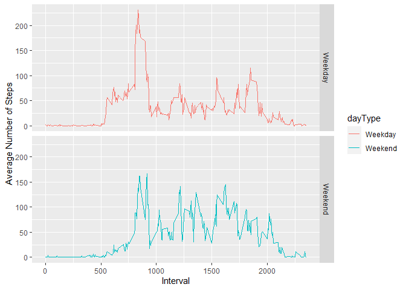

## Loading and preprocessing the data
First we load the data.

```r
unzip("activity.zip")
activity <- read.csv("activity.csv", stringsAsFactors = FALSE)
```

Convert date inputs to variables of the date class.

```r
activity$date <- strptime(activity$date, format = "%Y-%m-%d")
activity$date <- as.Date(activity$date, "%Y-%m-%d")
```
  
  
## What is mean total number of steps taken per day?  


Calculate the total numbers of steps taken per day, and create a histogram of the values.  

```r
dayTotals <- aggregate(steps ~ date, activity, sum)
hist(dayTotals$steps, xlab = "Total Daily Steps", main = "Histogram of Total Daily Steps", breaks = c(0, 2500, 5000, 7500, 10000, 12500, 15000, 17500, 20000, 22500, 25000), ylim = c(0,20))
```

<!-- -->

Calculate the mean and median total number of steps taken per day.

```r
dayMean <- mean(dayTotals$steps)
dayMean <- formatC(dayMean, digits = 2, format = "f")
dayMedian <- median(dayTotals$steps)
```
  
The mean total daily steps is 10766.19 and the median total daily steps is 10765.


## What is the average daily activity pattern?  

Calculate mean numbers of steps per interval over all days.  Plot calculations in a time series plot.

```r
intervalMeans <- aggregate(steps ~ interval, activity, mean)
plot(intervalMeans, type = "l", xlab = "Interval", ylab = "Average Number of Steps", main = "Average Daily Activity Pattern")
```

<!-- -->

Calculate which interval contains the maximum number of steps.

```r
maxVal <- max(intervalMeans$steps)
maxSteps <- subset(intervalMeans, intervalMeans$steps == maxVal)
```
The interval 835 contains the maximum numbers of steps, at a value of 206.1698113 steps on average.  

## Imputing missing values  

Calculate the total number of NAs present in the dataset.

```r
NA.vals <- is.na(activity$steps)
NA.sum <- sum(NA.vals)
```
The total number of NAs present is 2304.

We will impute the missing values based on the mean number of steps for that interval.

```r
activity_full <- activity
activity_full$steps <- ifelse(is.na(activity_full$steps), intervalMeans$steps[match(activity_full$interval, intervalMeans$interval)], activity_full$steps)
```

We now have a complete data set, with all missing values filled in.  The first 10 rows of the data set are shown below.

```r
head(activity_full, 10)
```

```
##        steps       date interval
## 1  1.7169811 2012-10-01        0
## 2  0.3396226 2012-10-01        5
## 3  0.1320755 2012-10-01       10
## 4  0.1509434 2012-10-01       15
## 5  0.0754717 2012-10-01       20
## 6  2.0943396 2012-10-01       25
## 7  0.5283019 2012-10-01       30
## 8  0.8679245 2012-10-01       35
## 9  0.0000000 2012-10-01       40
## 10 1.4716981 2012-10-01       45
```

A histogram of the total number of steps taken per day, including our imputed values, is shown below.

```r
dayTotalsFull <- aggregate(steps ~ date, activity_full, sum)
hist(dayTotalsFull$steps, xlab = "Total Daily Steps", main = "Histogram of Total Daily Steps with Imputed Data", breaks = c(0, 2500, 5000, 7500, 10000, 12500, 15000, 17500, 20000, 22500, 25000), ylim = c(0,30))
```

<!-- -->

```r
dayMeanFull <- mean(dayTotalsFull$steps)
dayMeanFull <- formatC(dayMeanFull, digits = 2, format = "f")
dayMedianFull <- median(dayTotalsFull$steps)
dayMedianFull <- formatC(dayMedianFull, digits = 2, format = "f")
```

The mean of the completed data set is 10766.19 and the median of the completed data set is 10766.19.  
We find that the mean and median of the dataset with the imputed values do not differ wildly from the estimates calculated from the original data set.  The mean has remained the same, and the median has increased slightly.  The histogram of the total daily steps has changed slightly, with an increase in frequency in the daily totals between 10,000 and 12,500 steps.  Overall, it appears that imputing the missing data did not have a large impact on our calculations.

## Are there differences in activity patterns between weekdays and weekends?  


We must create a factor variable to differentiate between weekdays and weekends.This variable will be called 'dayType'.

```r
activity_full$dayType <- sapply(activity_full$date, function(x) {
  if (weekdays(x) == "Saturday" | weekdays(x) == "Sunday") 
    {y <- "Weekend"} 
  else {y <- "Weekday"} })
```

We will create a plot to compare the average number of steps taken per interval across all weekdays days and all weekend days.

```r
library(ggplot2)
```

```
## Warning: package 'ggplot2' was built under R version 4.0.2
```

```r
intervalMeansType <- aggregate(steps ~ interval + dayType, activity_full, mean)
g <- ggplot(intervalMeansType, aes(interval, steps, color = dayType))
g <- g + geom_line() + facet_grid(dayType~.) + labs(x = "Interval", y = "Average Number of Steps")
print(g)
```

<!-- -->

